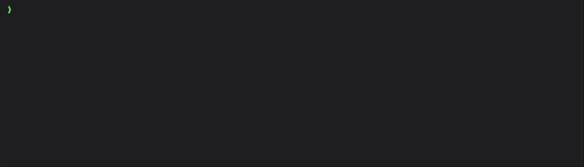

<div align="center">

ddev-typo3-multi-version-extension
===============================

[](https://addons.ddev.com)
[](https://github.com/jackd248/ddev-typo3-multi-version-extension/actions/workflows/tests.yml?query=branch%3Amain)
[](https://github.com/jackd248/ddev-typo3-multi-version-extension/commits)
[](https://github.com/jackd248/ddev-typo3-multi-version-extension/releases/latest)
</div>

## What is `ddev-typo3-multi-version-extension`?

ddev-typo3-multi-version-extension is a DDEV add-on that provides a multi-version TYPO3 environment. With this feature, it is possible to develop and test your extension with different TYPO3 versions at the same time.

## Support

- TYPO3 11.5
- TYPO3 12.4
- TYPO3 13.4

## Requirements

- Extension key as DDEV project name, e.g. `custom-extension`
- `apache-fpm` as webserver type
- a valid `composer.json` file in the project root directory

You may use the following command to create a new DDEV project with the required settings:

```shell
ddev config --project-type=php --docroot=public --webserver-type=apache-fpm --project-name=custom-extension
```

## 🔥 Installation

Install the add-on with the following command:

```shell
ddev add-on get jackd248/ddev-typo3-multi-version-extension && ddev restart
```

After the installation, you can use the following command to open the intro page:

```shell
ddev launch
```

To install TYPO3 instances, use the following command:

```shell
ddev install all
# or for a specific version
ddev install 12
```



For a detailed console output, use the following command:

```shell
ddev install 12 -v
````

## ⚙ Configuration

By default, a blank TYPO3 instance will be installed for each version. They are only two extensions installed:

- your **main extension** from the project root (symlinked)
- a demo **sitepackage extension** in from the `Tests/Acceptance/Fixtures/packages` directory

Use this sitepackage to test the features of your main extension. You can adjust it to your needs in `Tests/Acceptance/Fixtures/packages/sitepackage/`.

If you need more extensions for your setup, you can place them in the `Tests/Acceptance/Fixtures/packages` directory or adjust the `ddev install` command. Within the e.g. the [.install-12](commands/web/.install-12) file, you can adjust the `composer require` command to fit your needs.

> [!NOTE]
> You may not need all TYPO3 versions? You can remove the unwanted versions from the `TYPO3_VERSIONS` variable in [.ddev/docker-compose.typo3-setup.yaml](docker-compose.typo3-setup.yaml).

If you need additional data for the automatic installation process, place TYPO3 xml export files or sql files in the `Tests/Acceptance/Fixtures/` directory.

## 📊 Usage

You can launch a TYPO3 instance in your browser with the following command:

```shell
ddev launch 11
ddev launch 12
ddev launch 13
```

If you want to open the TYPO3 backend directly, use the following command:

```shell
ddev launch 13 /typo3
```

If you want to execute a console command in a specific TYPO3 instance, use the following command:

```shell
ddev 11 composer update
ddev 12 typo3 cache:flush
ddev 13 ls -la
```

You can also run a command in all TYPO3 instances at once:

```shell
ddev all typo3 cache:flush
```

## Background

The TYPO3 instances are located in the `.Build/` directory. The main extension is symlinked from the root directory to the `.Build/` directory. 

```text
.
└── .Build/
    ├── 11/
    │   ├── config/
    │   ├── packages/
    │   │   ├── sitepackage/
    │   │   └── your-ext/
    │   ├── public/
    │   ├── var/
    │   ├── vendor/
    │   ├── composer.json
    │   └── composer.lock
    └── ...
```

**Contributed and maintained by `@jackd248`**
